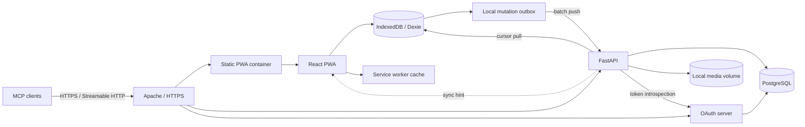

# Technical Architecture

Status: Draft architectural decision

## Decision summary

CookOps is a client-heavy progressive web application backed by a Python API and
PostgreSQL:

- frontend: React, TypeScript, and Vite;
- local browser database: IndexedDB through Dexie;
- PWA shell: `vite-plugin-pwa` with a custom service worker;
- backend: FastAPI, Pydantic, SQLAlchemy, Alembic, and psycopg;
- authoritative database: PostgreSQL;
- real-time transport: HTTP synchronization plus WebSocket invalidation hints;
- agent integration: an MCP Streamable HTTP endpoint implemented with the official
  Python SDK;
- MCP authorization server: a small TypeScript service built on `oidc-provider`,
  provisionally selected pending the interoperability spike in specification 20;
- receipt-photo storage: protected files in a local Docker volume;
- deployment: Docker Compose behind an existing host-level Apache HTTP Server
  reverse proxy on one VPS.

Exact dependency versions are pinned in lock files during implementation. Major
upgrades require tests and an explicit migration instead of floating production
images or packages.

## Why Python on the backend

FastAPI is selected instead of a JavaScript backend because:

- the maintainer already has Python backend experience;
- FastAPI exposes OpenAPI and JSON Schema from typed Pydantic models;
- a generated TypeScript client removes most cross-language contract duplication;
- FastAPI supports WebSockets and uploaded files without additional frameworks;
- the project's difficult part is offline synchronization semantics, not sharing
  one runtime language between browser and server;
- Python has mature libraries for data migration, image processing, PostgreSQL,
  and future Google Sheets import tooling.

Using TypeScript on both ends would simplify a small amount of model sharing, but
would not eliminate the API, database, offline-migration, or synchronization
boundaries. That benefit does not justify discarding the maintainer's Python
experience.

## Backend stack

- **FastAPI** provides the HTTP API, authentication callbacks, file endpoints,
  health checks, and WebSocket connection endpoint.
- **Pydantic** defines request, response, synchronization, and configuration
  models.
- **SQLAlchemy 2** is the explicit persistence layer. Domain complexity and version
  history favor SQLAlchemy over a thinner active-record abstraction.
- **Alembic** owns all PostgreSQL schema migrations.
- **psycopg 3** provides PostgreSQL connectivity through SQLAlchemy.
- Decimal quantities and monetary values use PostgreSQL `numeric`, Python
  `Decimal`, and decimal strings in JSON. Binary floating point MUST NOT be used for
  persisted quantities or money.

The API publishes an OpenAPI schema. The frontend client and TypeScript API types
are generated from that schema, and CI verifies that generated code is current.

The backend is divided into transport, application, domain, and persistence
boundaries. HTTP route handlers, synchronization handlers, maintenance commands,
and MCP handlers call the same application services. Business rules, authorization,
transactions, recipe scaling, shopping calculations, and version publication MUST
NOT be reimplemented inside an MCP tool.

## Frontend stack

- **React with TypeScript** provides the application UI.
- **Vite** builds the authenticated single-page application. Server-side rendering
  is not used because CookOps has no public SEO content and must render from a local
  offline database.
- **TanStack Router** provides typed application routes and URL state.
- **Dexie** provides a typed wrapper and reactive queries over IndexedDB.
- **vite-plugin-pwa** builds and registers a custom service worker for the
  application shell and immutable static assets.
- **Tailwind CSS** plus repository-owned accessible component primitives provide
  responsive styling. Components may be initialized from shadcn/ui, but generated
  code belongs to the repository and is adapted to CookOps.
- **dnd-kit** implements accessible pointer, touch, and keyboard drag-and-drop.
- **Milkdown** provides Markdown-backed WYSIWYG editing; raw Markdown editing uses
  a plain code/text editor mode.
- **i18next and react-i18next** provide Czech and English localization.

TanStack Query is not the primary domain-data store. Cached CookOps entities are
read from IndexedDB so online and offline rendering use the same path. It MAY be
used for online-only administration requests where a local replica has no value.

## PWA and local persistence

The service worker caches only the application shell and static assets. Domain data
is stored in IndexedDB and synchronized explicitly; arbitrary API responses MUST
NOT be treated as the offline database.

The client requests persistent browser storage where supported. It MUST still
handle browser eviction by rebuilding its cache from the server after the next
online login. Unsynchronized mutations and pending receipt photos receive prominent
warnings if persistent storage cannot be granted.

Client-side database migrations are versioned and tested in the same way as server
schema migrations. An application upgrade MUST migrate the local database without
dropping pending mutations.

## Synchronization protocol

CookOps uses a small application-specific protocol instead of a general replication
product.

### Local write path

1. The user action creates a stable UUID mutation identity in the browser, whether
   the browser is currently online or offline.
2. One IndexedDB transaction applies the optimistic local change and appends a
   granular mutation to the outbox.
3. React observes the new local state immediately through Dexie live queries.
4. When online, the sync worker pushes an ordered mutation batch.
5. The server authenticates and authorizes each mutation, deduplicates it by
   mutation identity, applies LWW field rules, and records its server change
   sequence in one PostgreSQL transaction per mutation.
6. The client applies the canonical response and removes acknowledged mutations.

A pushed batch is not atomic. Mutations are evaluated in order and an individual
failure does not roll back successful siblings. Multi-record workflows that require
atomicity are expressed as one application command.

### Pull path

- Each client maintains a server-issued cursor per cached organization.
- `sync/bootstrap` returns an authorized initial dataset and cursor.
- `sync/pull` returns ordered changes after a cursor and a new cursor.
- Every committed sync-visible transaction receives a monotonically increasing
  server sequence.
- A WebSocket message is only a hint that a newer cursor exists. The client always
  recovers through `sync/pull`, so a missed or disconnected WebSocket loses no data.
- If a cursor is older than retained change history, the server requests a safe
  bootstrap while the client preserves and later reapplies its pending outbox.
- Change-feed history is retained for at least 30 days.
- Bootstrap and pull return complete canonical sync records grouped by committed
  command transaction, not JSON patches.

### Mutation shape and LWW metadata

Mutations target explicit entities and fields instead of replacing a whole JSON
document. Each mutable field has server-side winning metadata consisting of:

- client wall-clock timestamp in UTC;
- mutation identity as deterministic tie-breaker;
- actor and client identity.

Immutable recipe and ingredient versions are inserted as separate entities.
Retirement is represented by a tombstone operation. These structures implement the
product conflict rules without a CRDT framework.

Push requests are bounded to 100 commands or 1 MiB of decoded JSON data and are
split by the client while preserving order. Detailed wire semantics are specified
in `18-synchronization-protocol.md`.

### Browser coordination

Multiple tabs on one device coordinate through `BroadcastChannel` and a browser
lock where supported. One tab acts as the active sync leader, while every tab reads
the same IndexedDB state. Losing the leader is harmless because mutations are
idempotent.

## Why not PowerSync or ElectricSQL

PowerSync was considered because it supports self-hosting, PostgreSQL logical
replication, and web clients. It is not selected because its server is
source-available under the FSL rather than open-source under a permissive or
copyleft OSI-style license. It would also add a replication service and sync-bucket
storage to a deployment serving only a few users.

ElectricSQL was considered for Postgres-to-client streaming. Its current design is
primarily a read-path sync engine; application writes still require a remote API.
CookOps already needs a write API for authorization, wall-clock LWW behavior,
version publication, and files, so it would solve only part of the required path.

The custom protocol is deliberately narrow and MUST be protected by convergence,
idempotency, reconnect, and offline end-to-end tests.

## Authentication and sessions

- The browser uses Google Identity Services for Sign in with Google.
- Google ID tokens are sent only over HTTPS and verified by the FastAPI backend,
  including signature, issuer, audience, expiry, and verified email.
- The server creates its own secure session after membership authorization.
- The browser uses a secure, HTTP-only, SameSite session cookie for online API and
  WebSocket authentication.
- Google access tokens are not needed and are not stored.
- The client stores a signed offline authorization lease containing only the
  identity, organization scope, and seven-day expiry needed for offline gating.
- The server never trusts the offline lease as authorization for synchronized
  writes. Queued mutations are checked against current membership when pushed.

If membership was revoked while a client was offline, rejected local mutations
remain recoverable for export or inspection but are not applied to organization
data.

### Pluggable human authentication

The session-issuing authentication adapter has two implementations:

- `google`, enabled in production and backed by verified Google identity tokens;
- `dummy`, enabled only in local development and tests and backed by deterministic
  seeded identities.

Both resolve an external identity to the same internal user and then invoke the
same membership gate and session issuer. Backend startup validation makes
`dummy` incompatible with the production environment. The production container
image MAY contain the adapter code, but there MUST be no configuration in which a
remote caller can enable it at runtime without changing trusted server deployment
configuration and restarting the service.

## Model Context Protocol endpoint

The API process exposes a versioned MCP endpoint over Streamable HTTP through the
host Apache reverse proxy. It uses a pinned stable release of the official Python
MCP SDK. The MCP transport is mounted as an ASGI application but remains an adapter
over CookOps application services, not a separate service with direct database
access.

The endpoint MUST:

- require an OAuth bearer access token on every remote request;
- resolve that token to one CookOps user and the intended canonical MCP resource;
- re-evaluate current organization membership and role authorization for every
  operation;
- validate the HTTP `Origin` header when present and enforce configured public
  host names;
- accept explicit organization and event identifiers instead of relying on a
  mutable browser-style "active organization";
- return structured, stable result objects suitable for agents;
- paginate potentially large catalogs, event schedules, shopping lists, and
  receipts;
- use stable identifiers and idempotency keys for mutating operations;
- expose actionable validation and authorization errors without leaking data from
  inaccessible organizations;
- attribute writes to both the represented user and OAuth client/grant;
- apply request-size, upload-size, and rate limits independently from the browser
  session endpoint.

### MCP OAuth authorization server

CookOps acts as the OAuth 2.1 authorization server for MCP clients and as the
protected MCP resource server. Google remains the upstream human identity provider:
the authorization endpoint establishes or reuses a CookOps browser session through
Google, verifies that the identity passes the CookOps membership gate, displays the
requesting MCP client, and asks the user to authorize that client. Development and
tests follow the identical OAuth flow with the dummy identity provider.

The OAuth implementation MUST provide:

- OAuth Authorization Server Metadata and MCP Protected Resource Metadata;
- authorization-code flow with mandatory PKCE using `S256` and exact redirect-URI
  matching;
- the canonical MCP URI as a resource indicator and access-token audience;
- short-lived opaque access tokens, rotating refresh tokens, revocation, and
  server-side expiry records;
- issuer identification in authorization responses and strict issuer validation;
- OAuth Client ID Metadata Documents as the preferred registration mechanism;
- Dynamic Client Registration as a compatibility mechanism for clients that do not
  yet support Client ID Metadata Documents;
- pre-registration for integration tests and explicitly configured clients;
- consent and grant revocation from the user's CookOps settings.

The proposed authorization-server component is a small internal TypeScript service
built on the MIT-licensed `oidc-provider` v9 release line. It is provisionally
selected because its documented protocol surface includes RFC 8414, DCR, PKCE,
revocation, introspection, RFC 8707, RFC 9207, opaque tokens, and experimental
CIMD. Specification 20 records the research, boundaries, risks, and mandatory
interoperability spike. Passing that spike is required before the decision becomes
accepted.

The authorization server owns OAuth protocol state in PostgreSQL and exposes
standards-based endpoints through Apache. FastAPI owns the human Google/dummy
session, CookOps consent UI, user and membership gate, and all domain
authorization. A one-time private interaction approval connects these components;
they do not share browser cookies. The MCP SDK `TokenVerifier` uses private RFC
7662 introspection and then reloads current CookOps authority for each operation.

CookOps MUST NOT implement cryptographic primitives, PKCE verification, token
generation, or bearer-token parsing from scratch. Exact provider and experimental
CIMD versions are pinned and upgraded only with compatibility tests.

Implicit, resource-owner-password, and client-credentials grants are not used for
interactive MCP access. Bearer tokens are stored hashed at rest, are never logged,
and are accepted only for the canonical CookOps MCP resource. Refresh-token reuse
revokes the affected token family.

Client metadata fetched by URL is an SSRF boundary. CookOps authenticates the user
before fetching it, requires public HTTPS targets, rejects loopback, private,
link-local, and reserved destinations after every DNS resolution and redirect,
limits redirects, response size, and timeout, and caches validated metadata for a
bounded period.

OAuth grants do not select an organization and do not create role-like scope
restrictions. A grant represents the whole current CookOps user. The MCP server
therefore sees every organization and operation currently available to that user,
including organization or system administration. Membership and role changes take
effect on the next operation without reauthorization. The OAuth scope identifies
CookOps MCP access as a whole; ordinary CookOps authorization remains the sole
capability boundary.

MCP clients operate online against the authoritative server. They do not take part
in the browser IndexedDB synchronization protocol. Successful MCP writes produce
normal server change records and WebSocket hints, so connected and later-syncing
web clients observe them through the existing pull path.

The MVP transport is remote Streamable HTTP. This is not considered a functional
restriction, and an additional `stdio` proxy is not required. One MAY be added later
only as a compatibility adapter; it must still complete remote OAuth and MUST NOT
embed a second application or bypass authorization.

## Receipt-photo storage

Photo metadata is stored in PostgreSQL. Image bytes are stored outside PostgreSQL in
a persistent local filesystem volume:

- clients assign a stable attachment UUID before upload;
- uploads use a temporary file followed by atomic finalization;
- final paths are generated from identifiers or content hashes, never user file
  names;
- authorization is checked before upload and download;
- the server verifies the declared media type, decoded image type, pixel bounds,
  and upload-size limit instead of trusting a filename or browser content type;
- thumbnails are generated for list and detail views;
- soft-deleted receipt files are retained according to the configured retention
  policy;
- the storage interface remains replaceable by S3-compatible storage in the
  future.

A separate MinIO service is intentionally avoided for the initial single-VPS,
low-user deployment. Local storage reduces operational complexity while retaining a
clean migration boundary.

## Source references

- [FastAPI features and OpenAPI](https://fastapi.tiangolo.com/features/)
- [Official FastAPI full-stack template](https://github.com/fastapi/full-stack-fastapi-template)
- [Vite guide](https://vite.dev/guide/)
- [Vite PWA service-worker precaching](https://vite-pwa-org.netlify.app/guide/service-worker-precache)
- [Dexie React live queries](https://dexie.org/docs/dexie-react-hooks/useLiveQuery%28%29)
- [Dexie persistent-storage guidance](https://dexie.org/docs/StorageManager)
- [Milkdown WYSIWYG Markdown editor](https://milkdown.dev/docs/guide/getting-started)
- [dnd-kit accessibility support](https://dndkit.com/extend/plugins/accessibility/)
- [Google backend authentication guidance](https://developers.google.com/identity/sign-in/web/backend-auth)
- [PowerSync self-hosting](https://docs.powersync.com/intro/self-hosting)
- [PowerSync licensing summary](https://github.com/powersync-ja)
- [Model Context Protocol transports](https://modelcontextprotocol.io/specification/2026-07-28/basic/transports)
- [Official MCP Python SDK](https://github.com/modelcontextprotocol/python-sdk)
- [MCP OAuth authorization](https://modelcontextprotocol.io/specification/2026-07-28/basic/authorization)
- [`oidc-provider` OAuth authorization server](https://github.com/panva/node-oidc-provider)
- [MCP Python SDK authorization boundary](https://py.sdk.modelcontextprotocol.io/run/authorization/)
