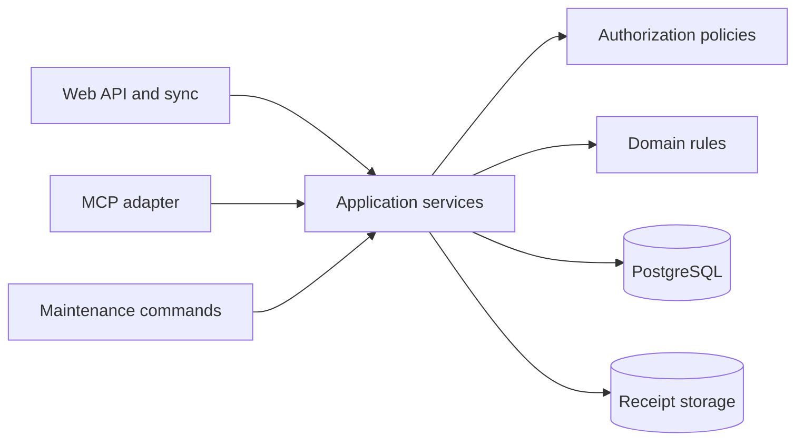

# Agent Interface and MCP

Status: Draft

## Goal

CookOps MUST expose a Model Context Protocol server so authorized agents can inspect
and operate the same organizations, catalogs, events, shopping lists, and costs as
human users. MCP is a first-class application adapter, not an administrative bypass
and not a replacement for the responsive web application.

The interface is designed for both interactive agent use and deterministic
automation. Every operation uses stable identifiers, machine-readable inputs and
outputs, pagination, explicit organization context, and actionable errors.

## Architecture boundary

MCP tools MUST call the same application services as HTTP and synchronization
handlers. They MUST NOT issue ad-hoc SQL, mutate ORM records directly, reproduce
domain calculations, or skip versioning and archival rules. A successful MCP write
creates the same change feed records and attribution metadata as an equivalent web
write.

## Authentication and authorization

- Anonymous MCP access is forbidden.
- Remote MCP clients MUST complete the standard OAuth 2.1 authorization-code flow
  with PKCE. Personal access tokens are not an MVP authentication mechanism.
- CookOps is the OAuth authorization server and protected resource. It uses Google
  Sign-In to establish the human identity during production authorization and the
  dummy provider during development and tests.
- An OAuth grant represents one internal CookOps user and has exactly that user's
  current application authority.
- Removing a membership or administrative role takes effect on the next MCP call;
  OAuth grants do not preserve historical authority.
- A grant covers all organizations to which the user currently belongs. It is not
  fixed to the organization that happened to be active during authorization.
- The same grant exposes member, organization-administrator, or system-administrator
  operations whenever the represented user currently holds that role.
- Every call supplies an explicit `organization_id` where organization data is
  involved. The server never infers it from the user's most recently active web
  organization.
- Identifiers from an inaccessible organization return a non-enumerating not-found
  or authorization response according to the common API security policy.
- Users can inspect and revoke their authorized MCP clients. Access and refresh
  tokens expire, are stored hashed at rest, and are never shown in CookOps settings.
- Production logs MUST NOT contain credential values, receipt contents, or full
  free-form notes.

The browser session participates only at the authorization and consent endpoint. It
is never copied into an MCP client. The MCP client receives resource-bound OAuth
tokens and sends a bearer access token on every MCP request.

## MCP primitives

### Resources

Resources provide compact, read-only context at stable URIs. Initial resource
families SHOULD include:

- organization summary and configuration;
- active event summary, schedule, days, notes, and warnings;
- resolved scheduled-recipe instance detail;
- recipe and ingredient catalog records and versions;
- shopping-list summary and expanded ingredient/contribution state;
- event budget and receipt summary.

Resource responses include identifiers and current version references. Large
collections are not embedded into a single resource; agents use paginated search or
list tools.

### Tools

The MCP tool surface MUST cover ordinary workflows rather than exposing one generic
database mutation tool. Expected tool families are:

- discover and search organizations, events, recipes, and ingredients;
- create and edit active events and days;
- publish, retire, restore, and search versioned recipes and ingredients;
- schedule, move, scale, and locally override recipe instances;
- inspect dietary warnings;
- create and refresh shopping lists;
- update available stock, manual purchase targets, sections, completion state,
  notes, and ad-hoc shopping items;
- inspect event cost summaries and create, edit, retire, or restore receipts and
  their photo attachments;
- archive, reactivate, and duplicate events where the represented role permits;
- administer organizations, roles, invitations, and memberships whenever the
  represented user's ordinary CookOps role permits it.

The MCP surface aims for operational parity with the web application, including
organization and user administration. A workflow is not omitted merely because it
is administrative; the common CookOps authorization policy remains authoritative.

### Receipt photos

MCP clients can list, attach, retrieve, replace, and remove receipt photographs.
Photo metadata and ordinary receipt results never inline image bytes automatically.

Two upload paths are supported:

- a bounded tool input containing a base64-encoded JPEG or WebP for maximum client
  compatibility;
- an MCP tool that creates a short-lived, single-use upload ticket bound to the
  represented user, receipt, media type, and maximum size, followed by a finalize
  tool after the authenticated HTTP upload.

The direct base64 path accepts at most 10 MB of decoded source data and MUST NOT
echo the encoded value in results, errors, logs, traces, or audit metadata. Both
paths run the same orientation normalization, metadata stripping, resize,
compression, image validation, storage, and thumbnail pipeline as web uploads.

An explicit photo-read operation can return MCP image content for a requested
attachment. List and receipt-detail results return only metadata and stable
attachment identifiers so ordinary agent context is not filled with image data.

Tool names and schemas are versioned API contracts. Inputs use catalog and entity
identifiers where ambiguity would be unsafe. Search tools may accept human names
and fuzzy text, but a mutating tool MUST reject ambiguous search matches instead of
silently selecting one.

### Prompts

CookOps does not require server-provided MCP prompts for the MVP. Focused prompts
for tasks such as checking an event plan or preparing a shopping run MAY be added
after the resource and tool contracts stabilize. Core functionality MUST NOT depend
on a particular model's sampling capability.

## Mutation safety

- Mutating calls accept a caller-generated idempotency key. Repeating a completed
  call with the same key and equivalent input returns the original outcome.
- Responses state what changed and return the affected stable identifiers and
  versions.
- Validation happens before mutation and uses the same transaction boundary as the
  web workflow.
- Bulk tools have explicit bounded limits and report an itemized outcome; they do
  not partially succeed silently.
- Soft deletion remains the default catalog and receipt removal behavior.
- Event archival or reactivation, cross-organization catalog copying, member
  removal, organization-administrator assignment or revocation, and organization
  retirement MUST require an explicit `confirm: true` input even when the OAuth
  grant has authority.
- Event duplication and reversible retirement of recipes, ingredients, tags,
  receipts, and shopping items do not require MCP confirmation.
- No generic arbitrary SQL, filesystem access, unrestricted HTTP fetch, or raw
  record patch tool is exposed.

MCP mutations are online server writes and therefore receive a server change
sequence. If an MCP write races an offline web mutation, the normal versioning,
tombstone, and per-field LWW rules decide the result.

## Presentation for agents

- Monetary and quantity decimals are returned as decimal strings, matching the
  HTTP contract.
- Dates use ISO 8601 calendar dates and timestamps use UTC RFC 3339 strings.
- Human-readable labels are included alongside stable identifiers where useful.
- Results SHOULD include short next-action hints for resolvable validation errors,
  but MUST NOT return huge prose dumps when structured fields suffice.
- List and search operations use opaque cursors and bounded page sizes.
- The server advertises descriptions that clearly distinguish read-only tools from
  mutations and high-impact operations.

## Transport and deployment

The first-class and MVP transport is OAuth-authenticated Streamable HTTP routed
through the host Apache reverse proxy to the existing API process. The server
validates allowed origins when the header is present, validates its public host,
and uses HTTPS in production. It follows the official MCP specification and pins a
stable official Python SDK version.

An additional local `stdio` proxy is not required for the MVP. If added for client
compatibility later, it completes the same remote OAuth flow and never receives
direct database or media-volume access.

## Evolution and compatibility

- The MCP surface has an advertised semantic interface version independent of the
  application release number.
- Additive optional fields and new tools are preferred over incompatible schema
  changes.
- Breaking changes require a documented migration period or a versioned tool name
  or endpoint.
- Contract snapshots and end-to-end client tests guard the advertised schemas.
- MCP support is included in backup/restore only through its database metadata;
  plaintext credential secrets are never present in backup manifests.

## Source references

- [Model Context Protocol Streamable HTTP transport](https://modelcontextprotocol.io/specification/2026-07-28/basic/transports)
- [Official MCP Python SDK](https://github.com/modelcontextprotocol/python-sdk)
- [MCP OAuth authorization](https://modelcontextprotocol.io/specification/2026-07-28/basic/authorization)
