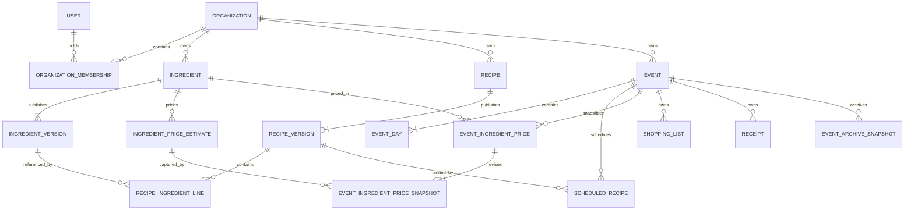
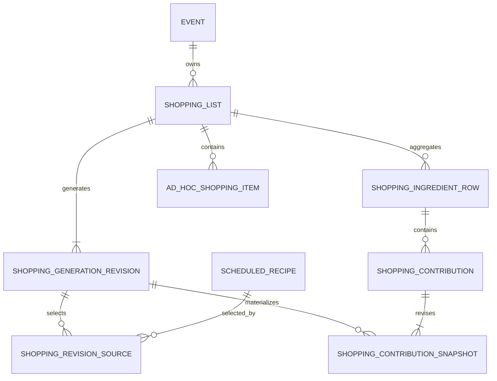
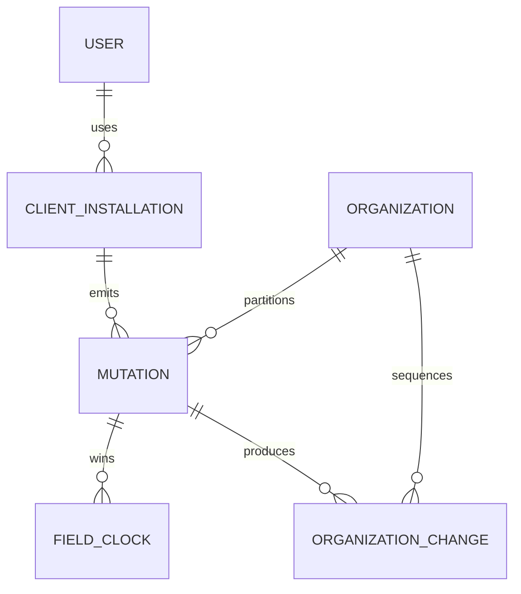

# Domain Model

Status: Draft domain and persistence decision

## Purpose

This document defines the conceptual CookOps domain model. It is intentionally
closer to a relational model than to frontend view models, but it is not a final
SQL migration. Names may change during implementation as long as the identities,
ownership boundaries, immutability rules, and invariants remain intact.

The model distinguishes four kinds of data:

1. mutable operational entities, such as an event or shopping row;
2. immutable published versions, such as a recipe version;
3. immutable generated or archived snapshots;
4. derived projections, such as remaining shopping quantity or dietary warnings.

Derived projections MUST have one authoritative formula and MUST NOT be stored as
independently editable state.

## Aggregate boundaries

An aggregate is the consistency and application-service boundary for a user
operation. It is not necessarily one database table.

| Aggregate root | Owns | Important atomic operations |
| --- | --- | --- |
| `Organization` | membership and organization configuration | invite, change configuration, retire |
| `Ingredient` | immutable ingredient versions and price estimates | publish version, publish price, retire, restore |
| `Recipe` | immutable recipe versions and version lines | publish version, retire, restore |
| `Event` | days, meal roles, scheduled recipes, overrides, dietary exceptions, event price snapshots | schedule, move, update version, refresh prices, archive |
| `ShoppingList` | generated revisions, ingredient rows, contributions, ad-hoc rows | generate, refresh, fulfil aggregate |
| `Receipt` | receipt metadata and photo attachments | create, edit, attach, retire, restore |
| `OAuthGrant` | consent and token family | authorize client, refresh, revoke |

Cross-aggregate operations are explicit application services. For example,
creating a shopping list reads an event projection and creates a new shopping
aggregate; later event changes never mutate that shopping list implicitly.

## Common conventions

### Identity

- Every persisted domain entity uses an opaque UUID as its identity.
- Any entity that can be created offline receives its UUID from the client before
  synchronization. Server-created entities use the same UUID shape.
- Sequential database identifiers, names, dates, list positions, and version
  numbers MUST NOT be used as external identity.
- Immutable versions use UUID identities because concurrent offline publications
  can create branches. An optional server-assigned display ordinal is not identity
  and is not required to be gap-free.
- References in APIs, synchronization, URLs, and MCP use UUIDs rather than names.

### Ownership

- Every organization-owned synchronization root carries `organization_id`
  directly, even when it can also be reached through an event or catalog parent.
  This supports authorization and organization-partitioned synchronization.
- A child cannot cross its aggregate or organization boundary unless a named copy
  operation creates a new identity in the destination organization.
- System-owned built-in definitions are read-only seeds and are distinguished from
  organization-owned records.

### Values

- Quantities, scaling amounts, percentages, prices, and money use arbitrary-precision
  decimal values, never binary floating point.
- Persisted ingredient quantities are normalized to the calculation unit identified
  by the containing immutable version or shopping row.
- Monetary values include or inherit an ISO 4217 currency code. An event has exactly
  one currency.
- Calendar dates are distinct from UTC timestamps. User actions record UTC RFC 3339
  instants while event days record calendar dates.
- Markdown is the canonical stored representation for Markdown-backed content;
  rendered HTML is a disposable projection.
- Ordered records use an opaque sortable position key. Their UUID is the stable
  identity and breaks equal-position ties deterministically.

### Creation, attribution, and retirement

Mutable roots and immutable versions retain `created_at` or `published_at` and the
responsible user. Synchronizable writes additionally retain mutation attribution
described below.

Soft deletion is represented by lifecycle metadata, not physical row deletion:

- active records have no retirement tombstone;
- retirement records the effective wall-clock timestamp, actor, client, and
  mutation identity;
- restore is an explicit later operation;
- immutable versions and referenced historical values are never deleted as a side
  effect of retiring their logical root.

## High-level relationships

## Identity and access

### `User`

Represents one human CookOps identity independently of an authentication provider.

Core fields:

- `id`;
- current display name;
- current verified-email display value and normalized matching value;
- optional preferred UI locale;
- creation and last-successful-login timestamps;
- disabled lifecycle metadata, if system access must be revoked globally.

System-administrator authority is represented by an explicit role assignment, not
inferred from organization membership.

### `ExternalIdentity`

Links a provider identity to one `User`.

Core fields:

- provider kind, initially `google` or `dummy`;
- provider subject identifier;
- verified email as asserted by the provider;
- linked `user_id`;
- first-seen and last-verified timestamps.

The pair `(provider, provider_subject)` is globally unique. Dummy identities are
valid only when the server runs in the development or test environment.

### `OrganizationMembership`

Represents invited, active, or removed organization access.

Core fields:

- `organization_id`;
- `user_id`, nullable until first successful claim;
- exact normalized invited Google email;
- role: `member` or `organization_admin`;
- state: `invited`, `active`, or `removed`;
- inviter, invitation time, claim time, and removal attribution.

An invited membership exists before the user exists or first logs in. Claiming it
links the verified provider identity to the membership atomically. Active duplicate
memberships for the same organization and user or invited email are forbidden.
Only a system administrator can create or remove the
`organization_admin` assignment.

### `SystemRoleAssignment`

Grants `system_admin` to a user or to an exact invited email before first login. It
retains grant and revocation attribution. System authority is global and does not
require a membership record.

### Browser security support

`BrowserSession` is a revocable server-side session record linked to a user. Its
cookie contains only an opaque session secret. An offline authorization lease is a
signed, expiring client artifact derived from a successful authorization check; it
is not accepted as server write authorization and is not a separate domain user.

## Organization and configuration

### `Organization`

Core fields:

- `id`, name, and optional description;
- default currency, initially `CZK`;
- lifecycle metadata;
- creation attribution.

Retiring an organization blocks ordinary access and creation but does not delete
memberships, catalogs, events, archives, or media.

### `UnitDefinition`

Represents a system-built-in or organization-owned quantity/scaling unit.

Core fields:

- scope: system or one organization;
- stable code and localized built-in labels or a user-entered custom name;
- dimension: mass, volume, count-like, or custom;
- conversion factor to the dimension's system base unit when conversion exists;
- whether recipe suggestions conventionally round upward to whole units;
- permitted contexts: ingredient quantity, recipe scaling, or both;
- lifecycle metadata for organization units.

Conversion semantics, dimension, and base factor are immutable after first use.
Renaming a custom display label does not alter quantity semantics. Built-in mass
and volume definitions cover `g`, `kg`, `ml`, `cl`, `dl`, `l`, `tsp` (5 ml), and
`tbsp` (15 ml). Piece, package, and bunch are built-in count-like units. Person,
tray, batch, pot, and loaf are built-in recipe-scaling units; piece and liter are
also available for scaling. Non-SI custom units have no implicit conversion to
another custom unit, and custom display names are not translated.

Whole-unit rounding is suggestion behavior only. Persisted manual scaling amounts
remain non-negative decimals for all units.

### `StoreSection`

An ordered, soft-deletable organization record containing a name and position.
Ingredient versions may select one as their default; shopping rows snapshot and may
override it.

### `OrganizationMealRolePreset`

An ordered organization default for new events. A built-in preset stores a stable
translation key; a custom preset stores a user-entered name. Creating an event
copies enabled presets into event-owned roles so later organization edits do not
rearrange past or active event plans.

### `RecipeTag`

An organization-owned stable identity with name, color, and lifecycle metadata.
Recipe-version membership is immutable, while renaming or retiring the tag does not
rewrite recipe versions.

### `DietaryLabel`

An organization-owned problematic-ingredient label with name, optional compact
presentation metadata, and lifecycle state. Vegetarian and vegan are never inferred
from one another.

### `DietaryRequirementDefinition`

An organization-owned named requirement such as vegan. Its incompatibility rules
are a set of references to `DietaryLabel` identities. Requirement definitions and
their rules are mutable for active events; archive snapshots copy the resolved rule
names and outcomes.

## Ingredient catalog

### `Ingredient`

The stable logical catalog identity.

Core fields:

- `organization_id`;
- `current_version_id`;
- optional `current_price_estimate_id`;
- lifecycle and creation attribution;
- optional copy provenance for administrative cross-organization copies.

`current_version_id` must reference a version belonging to the same ingredient.
The optional current-price pointer follows the same ownership rule. Concurrent
published versions or estimates remain valid even when only one wins its mutable
current pointer.

### `IngredientVersion`

An immutable publication containing:

- `ingredient_id` and optional `based_on_version_id`;
- name;
- canonical unit;
- required positive mass per canonical quantity for volume, count-like, or custom
  units; mass units derive it from their built-in conversion;
- default store section snapshot/reference;
- publication author and time;
- optional server display ordinal.

`IngredientVersionDietaryLabel` immutably associates the version with zero or more
organization dietary labels.

All versions of one logical ingredient MUST retain compatible quantity semantics.
Changing from grams to kilograms is compatible; changing the same logical
ingredient from mass to pieces without an explicit stable conversion is not. A
semantically incompatible replacement requires a new logical `Ingredient`. This
guarantees that recipe and shopping quantities for one ingredient can be
aggregated.

An ingredient version cannot be published unless its mass conversion is defined
and positive. This makes prepared total and per-diner weight available for every
valid recipe while keeping the conversion historically stable in the immutable
ingredient version.

### `IngredientPriceEstimate`

An immutable publication in a logical ingredient's independent price stream.

Core fields:

- `ingredient_id` and optional `based_on_estimate_id`;
- state: `available` or `unavailable`;
- for an available estimate, non-negative price amount, positive priced quantity,
  unit compatible with the ingredient's quantity semantics, and ISO 4217 currency;
- publication author and server time;
- optional server display ordinal.

The currency is the organization's default currency at publication. The MVP has no
store dimension and performs no foreign-exchange conversion. Publishing an
unavailable estimate is the explicit way to clear the current catalog price while
retaining history.

Publishing a price estimate advances `Ingredient.current_price_estimate_id` but
does not create an `IngredientVersion` or `RecipeVersion`, move any recipe pointer,
or participate in recipe-update availability. Cost is calculated by converting a
resolved ingredient quantity into the estimate's compatible priced unit and
multiplying it by `price amount / priced quantity`.

## Recipe catalog

### `Recipe`

The stable logical catalog identity, containing organization ownership,
`current_version_id`, lifecycle metadata, and optional copy provenance.

### `RecipeVersion`

An immutable publication containing:

- `recipe_id` and optional `based_on_version_id`;
- name and Markdown description;
- scaling unit;
- base scaling amount;
- optional estimated diners per scaling unit;
- whole-unit-suggestion flag;
- publication author, time, and optional display ordinal.

`RecipeVersionTag` immutably records tag membership for that version.

The MVP scaling model is identified as `single_variable`. Keeping an explicit model
kind allows future versions to use named inputs and formulas without changing
`Recipe` or `RecipeVersion` identity. Only the single-variable model with
proportional and fixed lines is valid in the MVP.

### `RecipeIngredientLine`

An immutable child of a recipe version containing:

- its row UUID;
- a stable `line_key` preserved when the conceptual line is carried into a newer
  recipe version;
- referenced `ingredient_version_id`;
- normalized base quantity and optional preferred compatible display unit;
- optional preparation or shopping note;
- position within the recipe;
- scaling behavior: `proportional` or `fixed`;
- `include_in_portion_weight`, defaulting to true.

For a proportional line, resolved quantity is base quantity multiplied by selected
scale divided by recipe base scale. For a fixed line, resolved quantity remains its
base quantity. The portion-weight flag affects only prepared total and per-diner
weight. A nonzero excluded line still contributes to price, shopping generation,
and dietary warnings.

New conceptual lines receive new `line_key` values. Removing a line means omitting
that key from the newer recipe version. A line key MUST NOT be reused for a
different logical ingredient. Stable keys make event-override preservation and
catalog-update previews deterministic.

## Event planning

### `Event`

Core fields:

- organization, name, inclusive nominal start and end dates;
- optional location and general note;
- base expected attendance;
- overall budget and fixed event currency;
- lifecycle: `active` or `archived`;
- current archive snapshot reference when archived;
- creation and lifecycle attribution.

Attendance is a non-negative integer. Consumption percentages are non-negative
decimals and are not artificially capped at 100 percent.

### `EventDay`

Contains event, calendar date, editable note, visibility, provenance indicating
whether it was range-generated or manually added, and position if a deterministic
tie is needed. An event has at most one non-retired day for a calendar date. Hiding
a generated day is distinct from deleting its scheduled recipes.

### `EventMealRole`

An event-owned role with name or built-in translation key, display position,
optional source preset, and lifecycle metadata. Scheduled recipes reference the
event copy, never the mutable organization preset.

### `ScheduledRecipe`

Represents one placement of one pinned catalog recipe version.

Core fields:

- event and day;
- event meal role;
- pinned `recipe_id` and `recipe_version_id`;
- explicit final diner count;
- attendance mode: `follows_event` or `manual`;
- consumption percentage;
- selected scale amount;
- scale mode: `suggested` or `manual`;
- event-specific note;
- position within its day and role;
- creation attribution and optional retirement tombstone.

New schedules start with attendance mode `follows_event` and scale mode `suggested`.
Editing either value directly changes the corresponding mode to `manual`. A
following diner count tracks event base attendance. A suggested scale tracks its
derived suggestion. A manual scale survives later suggestion changes and exposes
the changed suggestion plus an explicit action to adopt it again. Whole-unit
rounding applies to suggestions only; a manual scale may be decimal.

Updating to a catalog version with a compatible scaling unit preserves selected
scale and scale mode. An incompatible scaling-unit change requires confirmation and
resets both to the new version's suggestion, falling back to its base scale when no
attendance-derived suggestion exists. Ingredient-override preservation is decided
separately.

The day and meal role must belong to the same event. The pinned recipe and version
must belong to the event's organization, and the version must belong to that
recipe. Suggested scale, resolved quantities, weight, cost, and warnings are
derived projections; the selected scale amount is persisted.

### `ScheduledIngredientOverride`

Represents either an overridden catalog line or an event-local added ingredient.

Core fields:

- scheduled recipe;
- override kind: `replace` or `add`;
- target recipe `line_key` for `replace`, absent for `add`;
- pinned ingredient and ingredient-version identity;
- normalized quantity, including zero;
- `include_in_portion_weight` for an `add`, defaulting to true; a `replace` inherits
  the target catalog line's value;
- optional local note and position;
- creation or last-write attribution.

At most one active replacement override exists for a line key. An added override
has its own stable UUID and always references an organization catalog ingredient
version. During a catalog-version update, line keys implement the preserve/discard
rules. A preserved override whose base line disappeared becomes a local added line
without losing its identity or value.

### `EventDietaryException`

Represents one named exception rather than a participant roster. It contains event,
required name, optional free-form note, lifecycle metadata, and zero or more
`EventDietaryRequirement` references to organization requirement definitions.

### `EventIngredientPrice`

A stable event-owned identity unique by event and logical ingredient. It contains
`current_snapshot_id` and creation attribution. It is created when the ingredient
first has a nonzero resolved use in the event and remains retained if that use is
later removed, so re-adding the ingredient does not silently adopt a newer price.

### `EventIngredientPriceSnapshot`

An immutable capture belonging to one `EventIngredientPrice`.

Core fields:

- optional previous snapshot;
- optional source `IngredientPriceEstimate`;
- state: `available` or `unavailable`;
- copied price amount, priced quantity, compatible unit, and event currency when
  available;
- capture actor, effective client action time, server receive time, and originating
  mutation.

An unavailable snapshot represents no catalog estimate, an explicitly unavailable
current estimate, or a catalog price whose currency does not match the event. It is
persisted rather than inferred from the live catalog.

First use may capture the immutable estimate referenced by an offline client's
cached current-price pointer. This does not create a conflict with a later catalog
price publication because existing event snapshots never follow that pointer
implicitly.

The event command `update_price_estimates` inserts one new snapshot for every
existing `EventIngredientPrice` and every currently used ingredient not yet mapped,
then atomically advances all affected current-snapshot pointers. The command reads
the server-current catalog price estimates when it executes. An offline client may
queue the intent but cannot choose cached values and claim that the refresh is
current.

### Derived event projections

The following are calculated from authoritative entities and are not independently
editable records:

- suggested scaling amount;
- resolved scheduled ingredient lines after scaling and overrides;
- prepared serving total and per-diner weight, using only lines included in portion
  weight;
- total and per-diner estimated price from current event ingredient-price
  snapshots, plus the identities of any nonzero ingredients missing a usable price;
- dietary warnings for every named exception and scheduled recipe;
- catalog-update availability and transient update preview;
- event cost summary.

A quantity overridden to zero is excluded from weight, cost, shopping generation,
missing-price warnings, and dietary-warning inputs.

## Shopping model

### `ShoppingList`

Contains organization, event, required name, `current_generation_revision_id`, and
creation attribution. It intentionally has no draft/active/completed status.

The current revision pointer must reference a revision of the same list. Concurrent
offline refreshes create separate immutable revisions; LWW selects the current
pointer without deleting the other revision.

### `ShoppingGenerationRevision`

An immutable materialization created at list creation or explicit refresh.

Core fields:

- shopping list and optional parent revision;
- author and generation time;
- optional display ordinal.

`ShoppingRevisionSource` immutably lists the selected scheduled-recipe instances.
The revision remains readable even if a source is later moved, updated, retired, or
removed from a newer shopping revision.

### `ShoppingIngredientRow`

A stable mutable row unique by shopping list and logical ingredient.

Core fields:

- shopping list, ingredient identity, snapshotted display name, and fixed compatible
  calculation unit;
- available-supply quantity, initially zero;
- nullable manual purchase target;
- automatic-target value and generation-revision identity captured when the manual
  target was last set, for detecting and explaining later automatic changes;
- optional store-section override and snapshotted default section;
- aggregate-level fulfilment credit;
- effective estimated unit-price snapshot copied from the event and its capture
  time where applicable;
- creation and mutable-field attribution.

Generated quantity, automatic target, effective target, total credit, remaining
quantity, expected cost, and UI state are derived using `06-shopping.md`. They are
not mutable columns. A row remains retained when all current source contributions
are retired so historical credit and details remain explainable.

Setting or editing a manual target atomically captures the then-current automatic
target and generation revision. A later difference is the basis for the
non-blocking refresh notice; clearing the manual target also clears this basis.

### `ShoppingContribution`

The stable operational identity for one source and ingredient in one list.

Core fields:

- shopping ingredient row;
- scheduled-recipe source identity;
- stable source key `(shopping_list_id, scheduled_recipe_id, ingredient_id)`;
- fulfilment credit;
- latest checkbox actor, client, and effective time.

The source key is unique. Multiple resolved recipe lines for the same logical
ingredient and scheduled recipe combine into this contribution.

### `ShoppingContributionSnapshot`

An immutable contribution value in one generation revision.

Core fields:

- generation revision and stable contribution identity;
- active or retired-in-this-revision flag;
- generated quantity in the shopping row calculation unit;
- pinned ingredient-version identity and captured ingredient name;
- captured recipe name, day, meal role, scaling context, line notes, and relevant
  source notes;
- captured event estimated unit price and expected contribution cost.

Each generation revision contains a snapshot for every contribution identity known
to the list, including retired contributions required to explain retained credit.
Only active snapshots contribute to generated quantity `G`. Refresh creates a new
snapshot; it never mutates a prior one or the contribution's fulfilment credit.

### `AdHocShoppingItem`

A client-creatable, soft-deletable list-only row containing name, target amount,
unit, store section, optional note, optional estimated price, fulfilment credit, and
checkbox attribution. It has no catalog ingredient or recipe source. Its derived
remaining quantity and state follow `06-shopping.md`.

### Shopping invariants

- All selected source recipes belong to the shopping list's event.
- Every generated contribution uses a catalog ingredient from that event's
  organization.
- Every contribution quantity is compatible with its row calculation unit.
- Available supply is aggregate-only and is never allocated to contributions.
- Refresh changes only immutable generation data and the current-revision pointer;
  it does not overwrite operational row or credit fields.
- Aggregate check/uncheck is one logical operation with per-field LWW effects.
- Duplicate inclusion in a different shopping list is permitted and creates
  independent rows, revisions, and credit.

## Costs, receipts, and media

### `Receipt`

A client-creatable event-owned root containing organization, event, required title
or merchant, total amount in the event currency, optional calendar date, optional
note, lifecycle metadata, and attribution. A receipt total is non-negative and its
currency is inherited from and must equal the event currency.

Retired receipts are excluded from actual-cost totals but remain restorable.

### `ReceiptAttachment`

A client-creatable, ordered child containing:

- receipt and organization identities;
- storage state: pending, ready, or failed;
- generated storage object key and thumbnail key;
- validated media type, byte size, pixel dimensions, and content hash;
- creation, finalization, and lifecycle attribution.

Original filenames, EXIF, and location metadata are not authoritative fields.
Pending local-only bytes and upload retry state live in IndexedDB until the server
finalizes the attachment. A ready attachment references immutable stored bytes;
replacement creates a new attachment identity and retires the previous one.

### `MediaUploadTicket`

An ephemeral, single-use server record for MCP or web upload flows. It binds a
hashed random secret to user, OAuth grant when applicable, attachment, media type,
maximum size, expiry, and use time. It conveys no authority beyond the associated
already-authorized attachment operation.

## Event archive snapshots

### `EventArchiveSnapshot`

Every archive operation creates a new immutable, schema-versioned snapshot and then
sets the event lifecycle to archived in the same database transaction.

Archiving is an online server operation. It requires every server-known receipt
attachment selected for the archive to be finalized; pending uploads must finish or
be explicitly removed first. Changes still queued only on an offline client are not
authoritative server state and cannot be included. If the event is archived before
they synchronize, normal authorization rejects those mutations while retaining
them in the client's recoverable rejected-work area.

Core fields:

- event and optional previous archive snapshot;
- archive schema version;
- creation actor and time;
- canonical structured payload;
- content hash;
- attachment manifest with stable IDs, object hashes, and sizes.

The payload copies values rather than relying only on live references. It includes:

- event, day, role, schedule, ordering, notes, attendance, budget, and currency;
- pinned recipe and ingredient version content, scaling, resolved overrides, tags,
  unit labels, event price snapshots, weights, and warning inputs/results;
- named dietary exceptions and resolved requirement/label names;
- every shopping list's current generated revision, retained contribution details,
  operational row state, ad-hoc items, and fulfilment attribution;
- receipts and retained attachment metadata;
- display names needed for historical attribution.

Receipt bytes remain in protected immutable media storage and are included by hash
in the archive manifest and backup.

The normalized event graph remains in PostgreSQL but server authorization rejects
ordinary mutations while archived. Archived reads use the immutable snapshot as
their historical source. Reactivation preserves the archive snapshot as history and
unlocks the normalized graph; a later archive creates another snapshot. Duplication
creates a new active event and new operational identities from the chosen snapshot
according to the duplication application's inclusion policy.

## Synchronization model

### `ClientInstallation`

A stable random identity for one browser profile or agent client installation. It
is linked to a user after authentication and is attribution, not authorization.

### `Mutation`

The server idempotency record for a client command.

Core fields:

- mutation UUID and optional logical operation UUID;
- organization scope or explicit system-administration scope;
- actor, client installation, and optional OAuth client/grant;
- client wall-clock timestamp and server receive time;
- command kind, target identities, and request hash;
- accepted, partially superseded, rejected, or failed outcome;
- resulting organization change sequence range.

Reusing a mutation UUID with different input is rejected. Reusing it with equivalent
input returns the original outcome.

Only organization-scoped mutations enter an organization change feed. Identity,
OAuth, and system-administration commands are online-only and use their own audit
and idempotency records rather than being replicated into an ordinary organization
cache.

### `FieldClock`

Conceptual metadata for each synchronizable mutable field:

- winning client wall-clock timestamp;
- deterministic mutation-ID tie-breaker;
- actor and client attribution.

It may be implemented as normalized rows, compact structured columns, or generated
metadata tables. The observable LWW comparison must be identical everywhere.
Immutable version and snapshot fields do not need field clocks.

### `OrganizationChange`

An ordered change-feed record with an organization-local monotonic sequence,
transaction identity, affected entity, operation kind, and canonical changed-field
payload. A committed domain transaction publishes all of its effects before the
cursor advances. Authorization filters the feed by current membership; a WebSocket
contains only a hint that a later sequence exists.

### Tombstones and rejected offline work

Lifecycle tombstones are durable synchronization data. A concurrent edit does not
implicitly restore a retired entity. Its field value remains retained so an
authorized explicit restore can recover it. A mutation rejected after membership
removal remains in the local rejected-work area and is never presented as
authoritative organization state.

## OAuth and MCP support

These records are conceptual requirements; the selected maintained OAuth component
may use different internal table names.

### `OAuthClientRegistration`

Represents a pre-registered, Client ID Metadata Document, or dynamically registered
MCP client. It stores client identifier, registration mechanism, validated metadata
or metadata hash, redirect URIs, validation time, and lifecycle state. Remotely
fetched metadata is never trusted without the SSRF and redirect controls in
`11-technical-architecture.md`.

### `OAuthGrant`

Represents one user's consent for one OAuth client and the canonical CookOps MCP
resource. It stores authorization and revocation attribution. It has no
organization field or role snapshot; current CookOps membership and role policies
are evaluated on every operation.

### `OAuthTokenFamily` and token records

A token family belongs to one grant. Opaque access and refresh secrets are stored
only as hashes with type, audience/resource, issue and expiry times, parent/rotation
relationship, use time where applicable, and revocation reason. Refresh-token reuse
revokes the family. Authorization codes are short-lived, single-use, hashed records
bound to client, redirect URI, resource, user, and PKCE challenge.

## Copying and duplication

- Cross-organization catalog copying creates new logical ingredient or recipe IDs
  and new immutable version IDs in the destination. No destination record retains
  a live reference to source-owned content.
- Optional provenance may record source organization, logical record, version, and
  copy time for attribution only; authorization never traverses it.
- A recipe copy must also copy or explicitly map every ingredient dependency into
  the destination organization before publication.
- Event duplication creates a new active event graph with new day, scheduled
  recipe, override, dietary-exception, shopping, receipt, and other operational
  identities for whatever content the duplication workflow includes. Immutable
  catalog versions may remain pinned only when the destination is the same
  organization.

## Database-enforced invariants

The relational schema SHOULD enforce at least:

- parent and child organization equality;
- current-version pointers belonging to their logical root;
- current-price-estimate and event-price-snapshot pointers belonging to their
  logical root;
- event day and meal role belonging to the scheduled recipe's event;
- recipe line ingredient versions belonging to the recipe organization;
- event recipe versions belonging to the event organization;
- one active membership per organization and user or exact invited email;
- one active event day per event calendar date;
- one replacement override per scheduled recipe and recipe line key;
- one shopping ingredient row per list and logical ingredient;
- one shopping contribution per list, source scheduled recipe, and logical
  ingredient;
- one contribution snapshot per generation revision and contribution;
- non-negative quantities, amounts, prices, credits, attendance, and budget;
- positive ingredient mass conversions for every published non-mass ingredient
  version;
- non-negative amounts and positive priced quantities for available ingredient
  price estimates;
- at most one event ingredient-price identity per event and logical ingredient;
- compatible unit dimensions at every normalized quantity boundary;
- receipt totals and event budget sharing the event currency;
- immutable version, generation-revision, and archive-snapshot rows rejecting
  updates after insertion.

Application authorization and richer transition rules remain application-service
responsibilities even when supporting constraints also exist in PostgreSQL.

## Model consequences

- Publishing and refresh never overwrite history; they insert immutable records and
  move a mutable current pointer.
- Offline branch creation is safe because identity does not depend on server-issued
  sequence numbers.
- Event planners and MCP use the same resolved projections and commands.
- Shopping checkboxes remain independently synchronizable without putting generated
  snapshot data under LWW.
- Archives remain readable even after catalog, organization configuration, user
  display names, or dietary rules change.
- Future multi-input recipe formulas can extend recipe-version scaling without
  changing recipe, schedule, shopping-source, or archive identity.

## Decisions still affecting the schema

The following questions remain intentionally delegated to
`14-open-questions.md`:

- receipt-photo retention and garbage collection;
- the maintained OAuth authorization-server component and its physical support
  tables.
