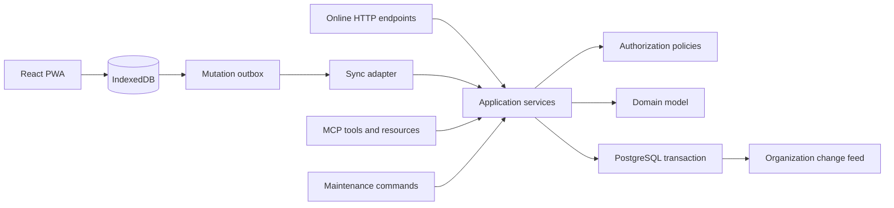

# Application Services and API Contracts

Status: Draft application contract

## Purpose

This document defines the boundary between CookOps transport adapters and its
application/domain layer. It describes business commands and queries rather than a
CRUD API over database tables.

The browser synchronization adapter, online-only HTTP endpoints, MCP tools, and
maintenance commands MUST invoke the same application services. An adapter may
perform transport-specific parsing, authentication, pagination, or confirmation
validation, but it MUST NOT reimplement authorization or domain behavior.

## Command model

An application command represents one complete user intent, such as publishing a
recipe version, moving a scheduled recipe, refreshing a shopping list, or archiving
an event. Commands are not arbitrary record patches.

Every mutating command has:

- a command or mutation UUID supplied by the caller;
- a command schema version and stable command kind;
- explicit organization scope, except for genuinely global identity or system
  administration operations;
- actor and authentication context derived by the trusted adapter, never accepted
  from the request payload;
- client installation and, for MCP, OAuth client/grant attribution;
- client wall-clock action time when the action may originate offline;
- a typed payload containing stable entity IDs and changed values;
- explicit preconditions when the workflow requires a preview or current-pointer
  check.

Entity UUIDs required by an offline create command are generated by the client and
included in its payload. Decimal quantities and money are decimal strings. Calendar
dates and timestamps follow the conventions in `16-domain-model.md`.

The application service validates authentication, authorization, aggregate state,
organization ownership, preconditions, and domain invariants before committing.
Actor, role, organization, client, and OAuth attribution are recorded from the
resolved execution context.

## Web write path

All ordinary web-application domain changes use the IndexedDB outbox, even while
the browser is online:

1. one IndexedDB transaction applies the optimistic local projection and appends
   the command;
2. the sync worker immediately attempts delivery when connected;
3. the server applies or rejects the command through the shared application
   service;
4. the browser reconciles the canonical outcome and subsequent change-feed data.

This rule gives online and offline interaction one behavior. Components MUST NOT
choose between a direct REST mutation and an outbox mutation according to current
connectivity.

Authentication, OAuth, membership and system administration, server-authoritative
archival, binary transfer, and operational maintenance remain online-only flows.
They use dedicated HTTP or MCP adapters but still call application services rather
than persistence directly. An online-only event command initiated by the web UI may
use the same command transport without optimistic local application.

## Transaction and batch semantics

- One application command is one PostgreSQL transaction.
- A sync push is only a transport batch. Commands are processed in request order,
  each in its own transaction.
- Failure or rejection of one command does not roll back successful commands from
  the same transport batch and does not prevent later commands from being
  evaluated.
- A later command may consequently fail when it depends on an earlier rejected
  command; its outcome identifies that missing or invalid precondition.
- If a business operation must be all-or-nothing across multiple records, it is one
  bulk domain command. The recipe-wide ingredient update, shopping generation
  refresh, event price refresh, aggregate shopping fulfilment, and archival are
  examples.
- A bulk command validates its bounded input before mutation and never reports
  silent partial success.

Every accepted organization-scoped command atomically commits its domain writes,
mutation outcome, and complete organization change-feed sequence range. Readers
never observe only part of that command.

## Idempotency

The command UUID is the canonical idempotency identity for web synchronization and
application services. MCP and dedicated HTTP mutations expose a caller-provided
`idempotency_key`; their adapters normalize it to the same persisted idempotency
record.

- Repeating an identity with semantically equivalent input returns its original
  outcome without applying the command again.
- Repeating it with different input returns `idempotency_mismatch`.
- Request hashes exclude credentials and non-semantic transport metadata.
- Idempotency records retain committed outcomes and deterministic domain rejections
  that callers must not retry as new writes without changing the user intent.
- Transient failures before a transaction commits remain retryable with the same
  identity.

## Command outcomes

Every command returns a structured outcome containing:

- command identity and kind;
- `accepted`, `partially_superseded`, `rejected`, or `failed` status;
- affected stable entity and immutable-version IDs;
- organization change sequence range when committed;
- canonical resulting field values or a compact reconciliation delta;
- stable error code and field-level validation details when not accepted;
- whether retrying the same identity is safe or will return the retained outcome.

`partially_superseded` is valid only for an ordinary command whose independent LWW
fields did not all win. Guarded and explicitly atomic workflows either commit their
whole defined result or are rejected.

## Preconditions and concurrency

Ordinary mutable scalar edits use the field-level LWW rules and do not require a
row-version precondition. Immutable publication and guarded workflows use explicit
identities instead:

- recipe and ingredient publication identify their based-on immutable version;
- recipe-wide ingredient update carries every previewed target version;
- scheduled-recipe catalog update identifies the expected pinned and target recipe
  versions plus the preserve/discard override choice;
- shopping refresh identifies its parent generation revision and complete selected
  source set;
- archival identifies the expected active event state while the server
  authoritatively checks all current receipt-attachment finalization state;
- cross-organization copying identifies all dependency mappings accepted in its
  preview.

A stale precondition returns `stale_precondition` with enough current identifiers
to request a new preview. The service MUST NOT silently substitute unseen current
versions.

## Authorization policies

Authorization is evaluated inside application services after authentication and
before returning scoped data or mutating state. Policy checks use current roles;
cached roles, OAuth grant-time roles, and client-supplied roles have no authority.

| Capability | Member | Organization admin | System admin |
| --- | --- | --- | --- |
| Read organization content | Yes | Yes | Yes |
| Edit ordinary organization content | Yes | Yes | Yes |
| Manage store sections, meal-role presets, units, tags | Yes | Yes | Yes |
| Publish, retire, or restore recipes and ingredients | Yes | Yes | Yes |
| Create and operate shopping lists and receipts | Yes | Yes | Yes |
| Create an event | No | Yes | Yes |
| Archive, reactivate, or duplicate an event | No | Yes | Yes |
| Invite or remove ordinary members | No | Yes | Yes |
| Copy catalogs into a destination organization | No | Yes, with source access | Yes |
| Create, retire, or restore an organization | No | No | Yes |
| Grant or revoke organization-admin authority | No | No | Yes |

A system administrator may execute organization-scoped commands without an
ordinary membership. Cross-organization copying by an organization administrator
requires at least member access to the source and administrator access to the
destination.

An organization administrator cannot grant or revoke organization-administrator
authority, remove an organization administrator as if they were an ordinary member,
remove their own administrative status, or otherwise change the system-admin-owned
role assignment. Membership and role changes are effective for the next server
operation, including MCP calls and queued offline mutations.

Authorization failures use a common non-enumerating policy. An identifier outside
the actor's readable scope MUST NOT reveal whether the record exists.

## Initial command catalog

Names below describe application contracts. Final Python method and public tool
names may follow language naming conventions, but their intent and transaction
boundaries remain stable.

### Organization and access

- `create_organization`, `update_organization`, `retire_organization`,
  `restore_organization`;
- `invite_member`, `remove_member`;
- `assign_organization_admin`, `revoke_organization_admin`;
- create, edit, reorder, retire, and restore store sections and meal-role presets;
- create, edit, retire, and restore organization units, recipe tags, and dietary
  tags, subject to their immutable-after-use fields.

These operations are online-only when they affect identity, membership, roles, or
the organization lifecycle. Ordinary organization configuration participates in
the organization replica and outbox.

### Ingredient and recipe catalogs

- `create_ingredient`, `publish_ingredient_version`,
  `publish_ingredient_price_estimate`, `retire_ingredient`, `restore_ingredient`;
- `create_recipe`, `publish_recipe_version`,
  `update_recipe_ingredient_versions`, `retire_recipe`, `restore_recipe`;
- `copy_ingredient_to_organization` and `copy_recipe_to_organization` with explicit
  dependency mappings.

Creating a catalog root and its initial immutable version is one command. Publishing
a later version inserts the complete version child graph and advances the mutable
current pointer. Price publication uses its independent stream.

### Event planning

- `create_event`, `update_event`, `archive_event`, `reactivate_event`,
  `duplicate_event`;
- add, edit, order, hide, restore, or retire event days and event meal roles;
- `schedule_recipe`, `move_scheduled_recipe`, `update_scheduled_recipe_context`,
  `retire_scheduled_recipe`, `restore_scheduled_recipe`;
- `update_scheduled_recipe_catalog_version` with one preserve/discard override
  choice;
- set, clear, or add scheduled ingredient overrides;
- create, edit, retire, and restore named dietary exceptions and their tag
  assignments;
- `update_event_price_estimates`.

Edits to diner count and selected scaling amount carry the corresponding
follow/manual or suggestion/manual mode transition in the same command. Resetting a
mode is explicit and never inferred from an equal numeric value.

### Shopping

- `create_shopping_list` with its complete initial source selection;
- `rename_shopping_list` and `refresh_shopping_list`;
- set available supply, manual purchase target, store-section override, and row
  notes;
- `set_shopping_contribution_fulfilment`;
- `set_shopping_row_fulfilment`, atomically expanding to every affected credit;
- create, edit, retire, restore, and fulfil ad-hoc shopping items.

Generation and refresh insert immutable revisions. They never mutate prior
generation data or delete fulfilment credits and ad-hoc items.

### Receipts and media

- `create_receipt`, `update_receipt`, `retire_receipt`, `restore_receipt`;
- create an attachment identity and upload ticket;
- finalize, retrieve, retire, restore, or replace a receipt attachment.

Receipt metadata may be created offline. Binary upload and finalization require
connectivity and use the validated media pipeline. Replacing an attachment creates
a new attachment identity and retires the previous one.

## Queries and projections

Queries never expose ORM entities directly. Application query services return
typed projections built from the same authoritative formulas used by commands.

Initial query families cover:

- current identity, organizations, memberships, and effective capabilities;
- organization configuration and active/retired catalog search;
- recipe and ingredient details and immutable version history;
- event summary, planner, resolved scheduled recipe, warnings, price coverage, and
  cost summary;
- shopping list summary, rows, contributions, generated revision, and fulfilment
  state;
- receipt summary, detail, and attachment metadata;
- guarded workflow previews, including recipe catalog updates, recipe-wide
  ingredient updates, and cross-organization copy mappings.

Potentially large lists use opaque cursors and bounded page sizes. Search responses
may rank fuzzy text matches but return stable IDs. Mutation inputs that originate
from search MUST use an unambiguous selected ID.

The PWA renders ordinary organization data from IndexedDB projections populated by
bootstrap, pull, optimistic commands, and reconciliation. It MUST NOT make online
query endpoints the hidden source of truth for screens that are required offline.
MCP resources and read tools call the same projection/query services directly.

## HTTP adapter surface

The versioned HTTP surface contains distinct transport families:

- browser authentication, session, logout, and current-identity endpoints;
- `sync/bootstrap`, `sync/pull`, and `sync/push` for replicated organization data;
- WebSocket change-availability hints;
- OAuth discovery, authorization, token, registration, and revocation endpoints;
- authenticated receipt-media upload and download endpoints;
- dedicated online administration and guarded-workflow endpoints where a replicated
  command is not appropriate;
- readiness, liveness, and deployment diagnostics with no domain data.

Ordinary domain entities do not also receive an independent mutable REST CRUD
surface. HTTP paths are versioned under `/api/v1` where applicable. OpenAPI covers
the browser-facing HTTP contracts; generated TypeScript models are checked into or
generated reproducibly according to the repository build policy.

## Error contract

Transport adapters map application failures to their native response shape while
preserving a stable CookOps error code. Initial codes include:

- `unauthenticated`, `forbidden`, and non-enumerating `not_found`;
- `validation_failed` with field paths;
- `stale_precondition` and `idempotency_mismatch`;
- `archived_event`, `retired_reference`, and `currency_mismatch`;
- `offline_not_supported`;
- `bootstrap_required` and `client_time_too_far_ahead` where applicable to
  synchronization;
- `rate_limited` and `temporary_failure`.

Synchronization responses may additionally carry a non-error
`clock_skew_warning`; it does not change an otherwise accepted command outcome.

Server messages are concise diagnostics, not localized UI copy. The Czech and
English clients localize known error codes and may show a safe fallback diagnostic.
Validation errors MUST NOT include secrets, binary contents, inaccessible names, or
full free-form notes.

## MCP confirmation boundary

The MCP adapter requires an explicit `confirm: true` for exactly these initial
high-impact operations:

- archive or reactivate an event;
- remove an organization member;
- assign or revoke organization-administrator authority;
- retire an organization;
- copy an ingredient or recipe across organizations.

Authorization is still evaluated after confirmation. Confirmation does not expand
authority and is not persisted as consent for later calls.

Event duplication and reversible retirement of a recipe, ingredient, tag, receipt,
or shopping item do not require this MCP confirmation. The web UI may still use
ordinary confirmation dialogs where usability testing finds them helpful.

## Contract verification

Automated contract tests MUST prove:

- equivalent web-sync and MCP commands invoke the same application service and
  authorization policy;
- each command commits its writes, outcome, and change-feed records atomically;
- one rejected batch item does not roll back or suppress unrelated items;
- retries with the same identity are idempotent and mismatched reuse is rejected;
- ordinary LWW commands can report partial supersession while guarded commands
  never partially apply;
- every role/capability row above has allow and deny coverage, including
  system-admin access without membership;
- inaccessible identifiers follow the non-enumerating error policy;
- MCP confirmation is required only for the documented high-impact operations;
- PWA ordinary writes use the outbox in both connected and disconnected tests.
