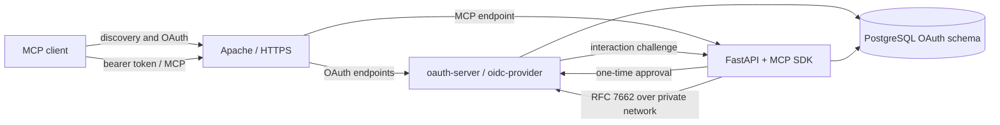

# MCP OAuth Research and Decision

Status: Proposed architectural decision

## Context

CookOps exposes one remote Streamable HTTP MCP endpoint. Every MCP client must use
the full interactive OAuth authorization-code flow with PKCE and receive exactly
the current authority of the represented CookOps user. Personal access tokens and
an authentication shortcut for development are not acceptable.

The current MCP authorization specification requires more than a conventional
login integration. In particular, the complete boundary includes:

- OAuth 2.1 behavior for public and confidential clients;
- authorization-server discovery through RFC 8414 or OpenID Connect Discovery;
- protected-resource metadata through RFC 9728;
- RFC 8707 `resource` parameters in both authorization and token requests and
  corresponding audience validation;
- RFC 9207 issuer identification in authorization responses;
- Client ID Metadata Documents (CIMD) as the preferred client-registration path;
- pre-registration and deprecated-but-compatible RFC 7591 Dynamic Client
  Registration (DCR);
- authorization code plus mandatory `S256` PKCE, refresh, introspection, and
  revocation.

The official Python MCP SDK supplies the resource-server half: protected-resource
metadata, bearer-token middleware, and a `TokenVerifier` integration point. Its
current documentation explicitly excludes login, consent, and token issuance and
advises new servers not to use the older embedded authorization-server provider.
CookOps therefore needs a separate authorization-server implementation even though
the MCP adapter remains inside FastAPI.

## Recommended decision

Add a small internal TypeScript service named `oauth-server`, built on the MIT
licensed [`oidc-provider`](https://github.com/panva/node-oidc-provider) v9 release
line. Treat the selection as provisional until the mandatory interoperability
spike below passes.

`oidc-provider` is currently the closest maintained open-source match to the MCP
profile. It documents support for RFC 8414, RFC 7591/7592, RFC 7009, PKCE, RFC 7662
introspection, RFC 8707 Resource Indicators, RFC 9207, opaque tokens, and
experimental CIMD draft 02. It is OpenID Certified and uses the MIT License.

The service is a CookOps component, not a second product or identity database. It
owns OAuth protocol state and endpoints while FastAPI remains the authority for
CookOps identities, memberships, roles, consent records presented to users, and
all domain authorization.

Exact `oidc-provider`, Node.js, and transitive dependency versions MUST be pinned.
CIMD upgrades are intentional reviewed changes because the provider documents that
experimental specification updates may introduce breaking behavior in minor
releases.

## Runtime topology

- Apache exposes one public CookOps origin and routes OAuth endpoints to
  `oauth-server` and MCP/application endpoints to `api`.
- `oauth-server` has no public container port; Apache reaches its loopback-bound
  port and FastAPI reaches its private introspection endpoint over the Compose
  network.
- Both services use the same PostgreSQL server. OAuth persistence is isolated in
  provider-owned tables or a dedicated schema and is covered by the ordinary
  database backup.
- The provider's in-memory adapter is forbidden outside tests. A repository-owned
  PostgreSQL adapter MUST implement provider expiry, consumption, and grant
  revocation semantics and store bearer credentials irreversibly where the
  provider contract permits it.
- The OAuth service MUST NOT query organization domain tables to decide what a user
  may do. That decision is made by CookOps application services on every MCP call.

## Identity and consent bridge

1. `oauth-server` validates the authorization request and creates an opaque,
   short-lived interaction challenge.
2. The browser is redirected to a CookOps interaction route. FastAPI establishes
   or reuses the normal CookOps browser session through Google in production or
   the dummy identity adapter in development and tests.
3. FastAPI applies the ordinary login membership gate, displays the validated
   client name, requested CookOps resource, scope, and consent action, and records
   the user's decision.
4. FastAPI returns a single-use approval bound to the interaction challenge,
   internal user UUID, client, resource, scope, expiry, and decision.
5. `oauth-server` consumes that approval and completes or rejects the OAuth
   interaction.

The services exchange interaction approvals through an authenticated private API.
They MUST NOT share or reinterpret each other's browser cookies. Approvals are
short-lived, single-use, audience-bound, and excluded from logs. The OAuth subject
is the stable internal CookOps user UUID, never an email address or Google subject.

The consent UI and grant-management UI are CookOps pages. A narrow internal API
lets the application list a user's clients and grants and revoke a selected grant;
it does not expose provider administration generally.

## Token and authorization model

- Only authorization-code and refresh-token grants are enabled for interactive MCP
  use. Public clients require `S256` PKCE and exact redirect-URI matching; implicit,
  hybrid, password, and client-credentials flows are disabled.
- The initial scope is one application-level scope, `cookops:mcp`. It permits MCP
  access but does not encode organizations or roles.
- Every authorization and token request must bind the grant to the configured
  canonical MCP URI through RFC 8707. Tokens for any other resource are rejected.
- Access tokens are opaque and short-lived. The initial target lifetime is 15
  minutes and remains configurable.
- FastAPI implements the MCP SDK `TokenVerifier` by calling RFC 7662 introspection
  on `oauth-server` over the private network. It validates active state, issuer,
  client, subject, scope, expiry, and exact resource/audience before constructing
  the MCP access context.
- Introspection is not positively cached for the initial low-user deployment. This
  makes access-token revocation immediately observable and keeps the design simple.
- Refresh tokens rotate. Reuse of an invalidated refresh token must revoke its
  grant or token family. This observable behavior is an interoperability-spike
  acceptance criterion rather than custom protocol code in FastAPI.
- Current membership and roles are reloaded on every MCP operation. Removing a
  member or changing a role therefore takes effect independently of access-token
  lifetime.
- Bearer values, authorization codes, interaction approvals, and client secrets
  are never logged or returned by CookOps settings APIs.

## Client registration and CIMD safety

CookOps supports client registration in this order:

1. explicit pre-registration for fixtures and known clients;
2. CIMD for capable clients;
3. DCR only for compatibility with older clients.

CIMD makes client-supplied URLs a network security boundary. The provider and its
CookOps wrapper MUST enforce public HTTPS, exact client-ID and redirect-URI rules,
bounded redirects, response size and timeout, repeated DNS/IP validation, and
rejection of loopback, private, link-local, multicast, and reserved destinations.
Metadata is cached only for a bounded period. DCR is rate-limited and may issue
registration management credentials only when required for interoperability.

## Alternatives considered

| Candidate | Finding | Decision |
| --- | --- | --- |
| Python MCP SDK embedded provider | Predates the current authorization-server/resource-server separation; the SDK documentation advises new servers not to use it. | Rejected. Use the SDK only for the MCP resource server. |
| Authlib | Mature Python OAuth primitives, PKCE, DCR, metadata, and revocation. Its documented authorization-server integrations are Flask and Django, while Starlette/FastAPI integration is a client; current provider docs do not expose native RFC 8707 or CIMD support. | Rejected. It would leave too much security-sensitive ASGI and MCP-profile code in CookOps. |
| OAuthLib | Useful low-level framework-neutral OAuth primitives, but CookOps would still own the authorization-server endpoints, persistence, RFC 8707 profile, CIMD, and much of the hardening. | Rejected for the same custom-protocol burden. |
| Keycloak | Operationally mature and supports OAuth 2.1, discovery, DCR, and experimental CIMD. Its own MCP guide currently reports that RFC 8707 Resource Indicators are not supported. | Rejected unless that gap closes; a custom Java extension is unjustified for this deployment. |
| Ory Hydra | Mature standalone OAuth/OIDC server, but adds another identity/consent integration surface and no verified first-class CIMD path was found in its current primary documentation. | Not selected. Re-evaluate if the recommended spike fails. |
| `oidc-provider` | Broadest verified match, including RFC 8707 and experimental CIMD, with a small embeddable MIT-licensed runtime. | Recommended, subject to the spike. |

## Risks and mitigations

- **A second runtime:** the backend remains Python, but deployment gains one small
  Node.js service. Keep it protocol-only, independently health-checked, and free of
  domain logic.
- **Experimental CIMD:** pin the exact package version and current MCP revision;
  run contract tests against representative clients; review upgrades rather than
  accepting minor releases automatically.
- **Specification-version mismatch:** the MCP 2026-07-28 text references CIMD
  draft 00 while the provider advertises draft 02. The spike must prove the exact
  metadata and redirect behavior used by supported clients.
- **Custom persistence adapter:** test expiry, code consumption, concurrent refresh,
  restart, revocation, and cleanup against PostgreSQL. Do not invent token or grant
  semantics outside the provider extension contract.
- **Single-maintainer dependency:** the provider describes itself as maintained by
  a sole maintainer. Pin it, monitor security releases, retain conformance tests,
  and keep the AS behind a narrow standard boundary so it can be replaced.
- **Cross-service interaction flow:** use one-time challenges and a small private
  API; threat-model login CSRF, consent CSRF, confused-deputy behavior, open
  redirects, replay, and log leakage before production.

## Mandatory implementation spike

Do not build the production MCP tool surface on this choice until a disposable
prototype demonstrates all of the following through Apache or an equivalent
path-preserving reverse proxy:

- RFC 9728 protected-resource discovery from the Python MCP SDK;
- RFC 8414/OIDC authorization-server discovery;
- pre-registered, CIMD, and DCR client paths with exact redirect validation;
- authorization code with `S256` PKCE and `resource` in both protocol requests;
- an opaque access token whose introspection result is bound to the canonical MCP
  resource and internal CookOps user;
- refresh rotation, replay handling, expiry, grant revocation, and restart-safe
  PostgreSQL persistence;
- Google and dummy identity adapters traversing the same interaction bridge;
- at least two representative agent clients plus the official MCP conformance
  suite where applicable;
- negative tests for wrong audience, issuer mix-up, SSRF targets, redirect abuse,
  malformed CIMD, oversized metadata, and leaked credentials;
- a documented fallback recommendation if CIMD or the persistence adapter cannot
  meet these criteria without patching provider internals.

Passing the spike changes this document to `Accepted`. Failure reopens the provider
choice; it does not authorize a reduced OAuth flow.

## Source references

- [MCP 2026-07-28 authorization specification](https://modelcontextprotocol.io/specification/2026-07-28/basic/authorization)
- [MCP client registration](https://modelcontextprotocol.io/specification/2026-07-28/basic/authorization/client-registration)
- [Official Python MCP SDK authorization boundary](https://py.sdk.modelcontextprotocol.io/run/authorization/)
- [`oidc-provider` implemented standards and support policy](https://github.com/panva/node-oidc-provider)
- [`oidc-provider` change log](https://github.com/panva/node-oidc-provider/blob/main/CHANGELOG.md)
- [Keycloak MCP authorization-server guide](https://www.keycloak.org/securing-apps/mcp-authz-server)
- [Authlib authorization-server documentation](https://docs.authlib.org/en/latest/oauth2/authorization-server/)
- [RFC 8707 Resource Indicators](https://www.rfc-editor.org/rfc/rfc8707.html)
- [RFC 9728 Protected Resource Metadata](https://www.rfc-editor.org/rfc/rfc9728.html)
